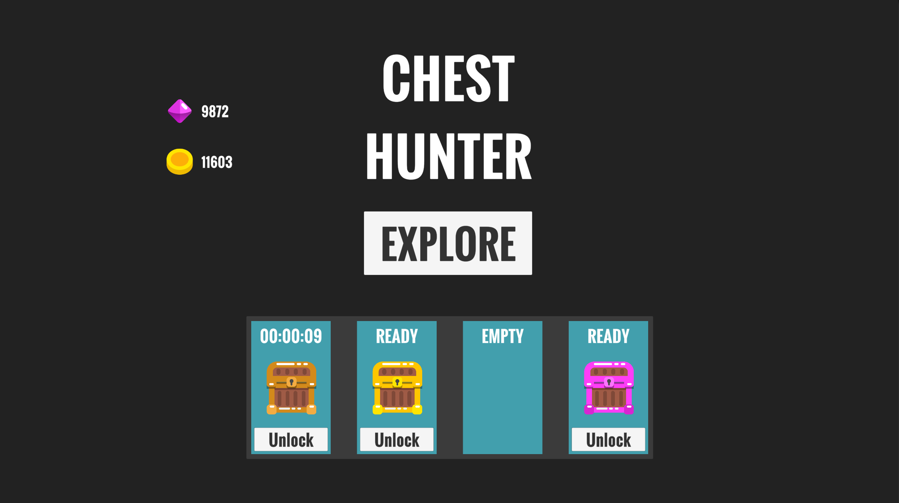
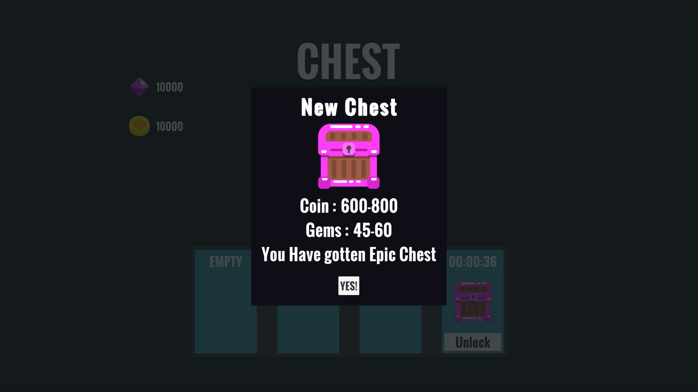
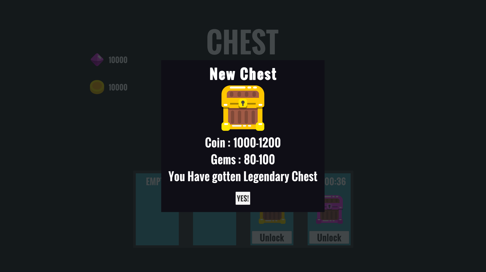
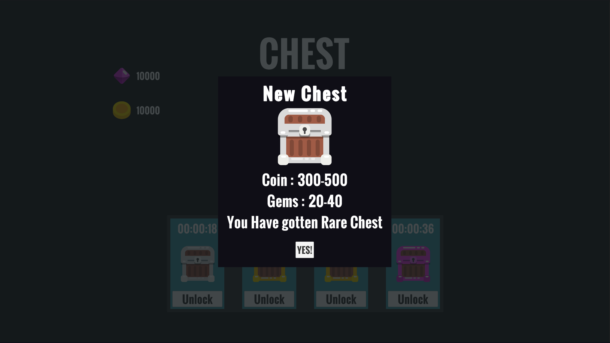
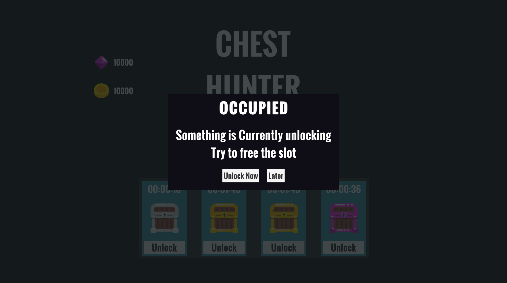
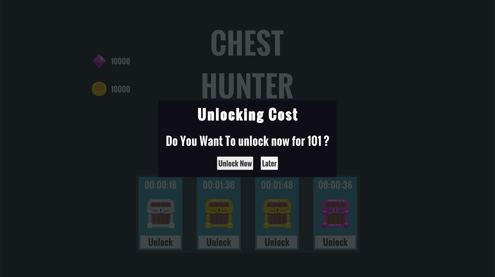
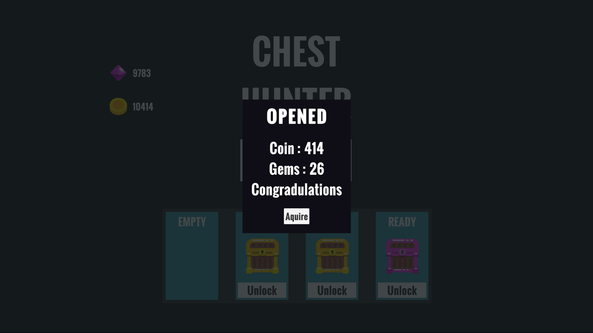

# Chest-System-Unity
 This is a Chest system like Clash royale
 
# feature
- Can create any no of chests
- Total no of slots can be expanded
- A Modal window that adjusts itself to fit the message 

# Design Patterns
- Singleton
- Observer pattern
- State Machine

# ScreenShots

